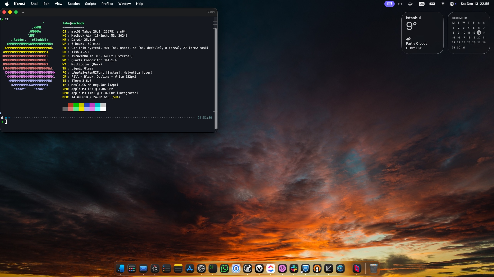
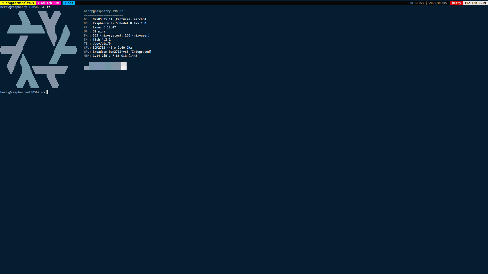

# mt190502's Dotfiles

A modular, cross-platform Nix configuration using flake-parts. Supports NixOS, macOS (nix-darwin), and standalone Home Manager.

## Structure

```sh
├── assets/                    # Wallpapers, screenshots, etc.
├── hosts/                     # Host-specific configurations
│   ├── <hostname>/            # Per-host config
│   │   ├── home/              # Home-manager overrides
│   │   ├── host/              # NixOS/Darwin system overrides
│   │   ├── config.nix         # Host configuration (platform, modules, profiles, etc.)
│   │   └── disko.nix          # NixOS disk configuration (if applicable)
│   └── flake-module.nix       # Build logic (nixosConfigurations, darwinConfigurations, homeConfigurations)
├── modules/                   # Reusable modules
│   ├── darwin/                # Darwin modules
│   ├── home/                  # Home-manager modules
│   │   ├── bin.nix            # Centralized binary path definitions
│   │   ├── preferences.nix    # User preferences (terminal, wm, menu, etc.)
│   │   └── wrapped/           # Linux-only wrapped binaries (dolphin, pcmanfm-qt, etc.)
│   ├── nixos/                 # NixOS modules
│   └── flake-module.nix       # Module builder
├── packages/                  # Custom packages (recidia, ubuntu-fonts-google, etc.)
│   └── flake-module.nix       # Package builder
├── profiles/                  # Configuration bundles
│   ├── darwin/                # Darwin profiles   
│   ├── home/                  # Home-manager profiles (ai, cloud, development, etc.)
│   └── nixos/                 # NixOS profiles
├── secrets/                   # Encrypted secrets (using sops or similar)
│   ├── <username>/            # User-specific secrets
│   │   └── <secretname>/      # Encrypted secret dir
│   │       ├── config.nix     # Secret configuration (e.g., environment variables)
│   │       └── secretfile     # Encrypted file (e.g., .env, credentials.json, etc.)
│   └── flake-module.nix       # Secret management logic
├── users/                     # User-level defaults
│   └── <username>/            # User-specific base config
│       ├── darwin.nix         # Darwin user config
│       ├── default.nix        # Centralized user config (imported by all platforms)
│       ├── home.nix           # Home-manager user config
│       └── nixos.nix          # NixOS user config
└── flake.nix                  # Flake entry point
```

## Hosts

| Host                                                                             | Description                                                                     | Screenshot                                                |
|----------------------------------------------------------------------------------|---------------------------------------------------------------------------------|-----------------------------------------------------------|
| [lenovo-thinkpad-e14-nixos-personal](./hosts/lenovo-thinkpad-e14-nixos-personal) | Laptop running a AMD Ryzen 5 7530U, 16GB of RAM and a AMD Barcelo Graphics      |  |
| [macbook-m3-air-darwin-work](./hosts/macbook-m3-air-darwin-work)                 | MacBook Air M3 Workstation Setup with nix-darwin and home-manager               |         |
| [msi-h510m-pro-fedora-personal](./hosts/msi-h510m-pro-fedora-personal)           | Desktop pc running a Intel i5-11400, 32GB of RAM and a MSI RX570 OC Edition 4GB |       |
| [raspberry-pi-5-nixos-server](./hosts/raspberry-pi-5-nixos-server)               | Raspberry Pi 5 server running NixOS with headless configuration                 |         |

## Architecture

### Layered Configuration

Configuration is organized in three layers, from generic to specific. This pattern applies to all platforms (NixOS, Darwin, Home Manager):

1. **`modules/`** — Reusable, platform-agnostic modules (e.g. `modules/home/`, `modules/nixos/`, `modules/darwin/`). Shared across all users and hosts.
2. **`users/<username>/`** — User-level defaults (e.g. `users/taha/`). Applies base config per user, regardless of host.
3. **`hosts/<hostname>/`** — Host-specific overrides (e.g. `home/` for user-level, `host/` for system-level). The most specific layer; overrides or extends user and module defaults for a particular machine.

Each layer inherits from the one above it, allowing shared defaults in `modules/` and `users/` while enabling per-host customization in `hosts/`.

### Host Configuration

Each host has `config.nix` defining:

```nix
{
  stateVersion = "25.11";
  platform = "nixos" | "darwin" | "home";
  arch = "x86_64-linux" | "aarch64-darwin";
  users = [ "taha" ];      # NixOS/Darwin only
  user = "taha";           # Home only
  modules = [ "docker" "pipewire" ... ];
  profiles = [ "development" "sway" ... ];
  packages = [ "recidia" ... ];
  nixSettings = { experimental-features = [ "nix-command" "flakes" ]; };
  extraConfig = { ... }: { };
}
```

## Installation

<details>
  <summary>NixOS Setups</summary>

- First, clone this repository to your system

  ```bash
  git clone <this-repo>
  cd dotfiles.nix
  ```

- Then, set up user and system configurations

  - For user configuration, change the username in the [users/](./users/) and `hosts/YOUR_CONFIG/home` directory
  - For system configuration, change the [hosts/](./hosts/) directory

- Then, set up disko configuration for your system (if you haven't already). Change
the `hosts/YOUR_CONFIG/disko.nix` file according to your disk layout. After that,
you can use the disko scripts to partition and format your disks.

  ```bash
  sudo nix run github:nix-community/disko -- --mode disko hosts/YOUR_CONFIG/disko.nix
  ```

- After that, you can mount partitions and install NixOS on your system using the
following command:

  ```bash
  sudo mount /dev/sdX3 /mnt                             #~ replace sdX3 with your root partition
  sudo mkdir -p /mnt/{boot/efi,home}
  sudo mount /dev/sdX1 /mnt/boot/efi                    #~ replace sdX1 with your EFI partition
  sudo mount /dev/sdX2 /mnt/home                        #~ replace sdX2 with your home partition
  sudo nixos-install --root /mnt --flake .#YOUR_CONFIG
  ```

</details>

<details>
  <summary>Darwin Setups</summary>

- First, clone this repository to your macOS system

  ```bash
  git clone <this-repo>
  cd dotfiles.nix
  ```

- Then, set up nix and nix-darwin on your macOS system (if you haven't already)

    ```sh
    NIX_VERSION="25.11" #~ or your desired Nix version like "25.05"
    curl --proto '=https' --tlsv1.2 -sSf -L https://install.determinate.systems/nix | sh -s -- install
    
    # relogin or restart your terminal session to have nix command available
    sudo nix-channel --add https://nixos.org/channels/nixos-${NIX_VERSION} nixpkgs
    sudo nix-channel --add https://github.com/nix-darwin/nix-darwin/archive/nix-darwin-${NIX_VERSION}.tar.gz darwin
    sudo nix-channel --update
    nix-build '<darwin>' -A darwin-rebuild
    ```

- Enable flake support in Nix

    ```sh
    echo "experimental-features = nix-command flakes" | sudo tee -a /etc/nix/nix.conf
    ```

- Then, set up user and system configurations

  - For user configuration, change the username in the [users/](./users/) and hosts/YOUR_CONFIG/home directory
  - For system configuration, change the [hosts/](./hosts/) directory

- After that, you can switch the configuration like below:

  ```bash
  sudo darwin-rebuild switch --flake .#macbook-m3-air-darwin-work
  ```

</details>

<details>
  <summary>Home Manager only Setups</summary>

- First, set up some packages on your system. (I'm using Fedora, so you can use this command to install them)

  ```bash
  sudo dnf install git curl fish swaylock mate-polkit
  ```

  - We need to install `swaylock`, `mate-polkit` and `fish` using the distribution's own package manager. Because the home-manager is not compatible with pam-locking. If you use another distribution, you can install it with your package manager.

- Set up Nix Package Manager on your system (if you haven't already or you don't have NixOS installed)

    ```sh
    NIX_VERSION="25.11" #~ or your desired Nix version like "25.05"
    curl --proto '=https' --tlsv1.2 -sSf -L https://install.determinate.systems/nix | sh -s -- install
    nix-channel --add https://nixos.org/channels/nixos-${NIX_VERSION} nixpkgs
    nix-channel --add https://github.com/nix-community/home-manager/archive/release-${NIX_VERSION}.tar.gz home-manager
    nix-channel --update
    nix-shell '<home-manager>' -A install
    ```

- Enable flake support in Nix

    ```sh
    echo "experimental-features = nix-command flakes" | sudo tee -a /etc/nix/nix.conf
    ```

- Switch this flake

    ```sh
    home-manager switch --no-out-link --flake github:mt190502/dotfiles.nix#msi-h510m-pro-fedora-personal
    ```

    Note: In this example, you must change username into the [hosts/msi-h510m-pro-fedora-personal/home/default.nix](./hosts/msi-h510m-pro-fedora-personal/home/default.nix) file.

</details>

## Credits

- [Kranzes](https://github.com/Kranzes) - Initial config structure
- [yomaq](https://github.com/yomaq) - Module system inspiration
- [usdogu](https://github.com/usdogu) - Support and inspiration
