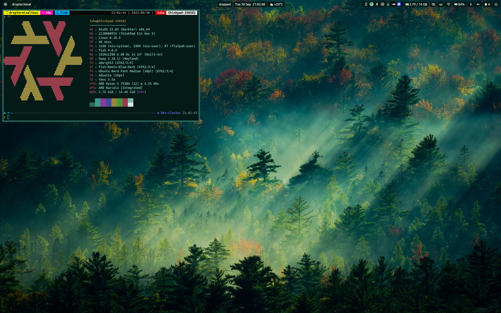
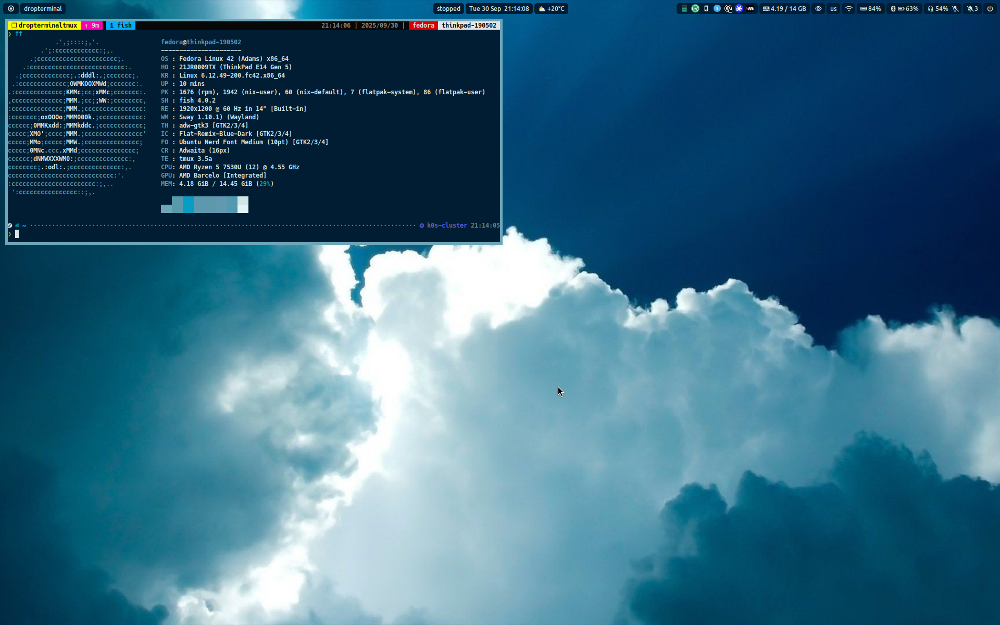
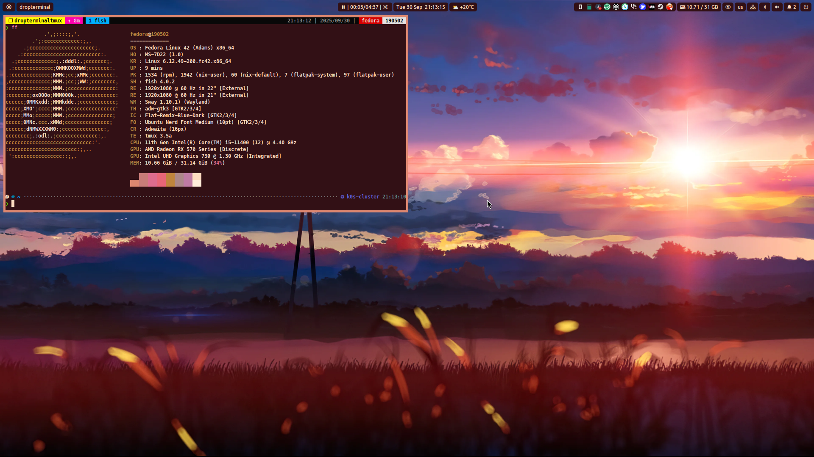

# mt190502's dots

This dotfiles is made for my personal use. I use it with Nix Package Manager, so you can use it with NixOS or Nix installed on your system.

## Configuration & Modules

| Name                   | Description                                                            |
| ---------------------- | ---------------------------------------------------------------------- |
| [Assets](./assets)     | Assets for the configuration (wallpapers, etc.)                        |
| [Hosts](./hosts)       | Configuration for hosts (laptop, desktop, etc.)                        |
| [Modules](./modules)   | Package configurations and nixGL wrapped packages                      |
| [Packages](./packages) | Modded & Custom packages                                               |
| [Users](./users)       | User configurations (home-manager)                                     |

## Hosts

| Name                                                             | Description                                                                     | Screenshot                                        |
| ---------------------------------------------------------------- | ------------------------------------------------------------------------------- | ------------------------------------------------- |
| [lenovo-thinkpad-e14-nixos](./hosts/lenovo-thinkpad-e14-nixos)   | Laptop running a AMD Ryzen 5 7530U, 16GB of RAM and a AMD Barcelo Graphics      |   |
| [lenovo-thinkpad-e14-fedora](./hosts/lenovo-thinkpad-e14-fedora) | Same as lenovo-thinkpad-e14-nixos but running Fedora instead of NixOS           |  |
| [msi-h510m-pro-nixos](./hosts/msi-h510m-pro-nixos)               | Desktop pc running a Intel i5-11400, 32GB of RAM and a MSI RX570 OC Edition 4GB |         |
| [msi-h510m-pro-fedora](./hosts/msi-h510m-pro-fedora)             | Same as msi-h510m-pro-nixos but running Fedora instead of NixOS                 |        |

## Installation

<details>
  <summary>NixOS Setups</summary>

- First, clone this repository to your system

  ```bash
  git clone <this-repo>
  cd dotfiles.nix
  ```

- Then, set up user and system configurations

  - For user configuration, change the username in the [users/](./users/) directory
  - For system configuration, change the [hosts/](./hosts/) directory

- After that, you can switch the configuration with the following command

  ```bash
  sudo nixos-rebuild switch --flake .#msi-h510m-pro-nixos
  ```

</details>

<details>
  <summary>Home Manager only Setups</summary>

- First, set up some packages on your system. (I'm using Fedora, so you can use this command to install them)

  ```bash
  sudo dnf install git curl fish swaylock xfce-polkit
  ```

  - We need to install Swaylock using the distribution's own package manager. Because the home-manager is not compatible with pam-locking. If you use another distribution, you can install it with your package manager.

- Set up Nix Package Manager on your system (if you haven't already or you don't have NixOS installed)

    ```sh
    NIX_VERSION="unstable" #~ or latest stable version e.g "25.05"
    curl --proto '=https' --tlsv1.2 -sSf -L https://install.determinate.systems/nix | sh -s -- install
    nix-channel --add https://nixos.org/channels/nixos-${NIX_VERSION} nixpkgs
    nix-channel --update
    ```

- Enable flake support in Nix

    ```sh
    echo "experimental-features = nix-command flakes" | sudo tee -a /etc/nix/nix.conf
    ```

- Set up home-manager from [this](https://nix-community.github.io/home-manager/index.xhtml#ch-installation) source

  - For unstable nixpkgs:

    ```sh
    nix-channel --add https://github.com/nix-community/home-manager/archive/master.tar.gz home-manager
    nix-channel --update
    nix-shell '<home-manager>' -A install
    ```

  - For stable nixpkgs:

    ```sh
    nix-channel --add https://github.com/nix-community/home-manager/archive/release-25.05.tar.gz home-manager
    nix-channel --update
    nix-shell '<home-manager>' -A install
    ```

- Switch this flake

    ```sh
    home-manager switch --no-out-link --flake github:mt190502/dotfiles.nix/unstable#msi-h510m-pro-fedora
    ```

    Note: In this example, you must change username into the [hosts/msi-h510m-pro-fedora/home/default.nix](./hosts/msi-h510m-pro-fedora/home/default.nix) file.

</details>

## Credits & Big Thanks

- [Kranzes](https://github.com/Kranzes) - I basically copy pasted and edited his [config](https://github.com/Kranzes/nix-config)
- [yomaq](https://github.com/yomaq) - For the module system [idea](https://github.com/yomaq/nix-config)
- [usdogu](https://github.com/usdogu) - Special thanks for the inspiration and support!
